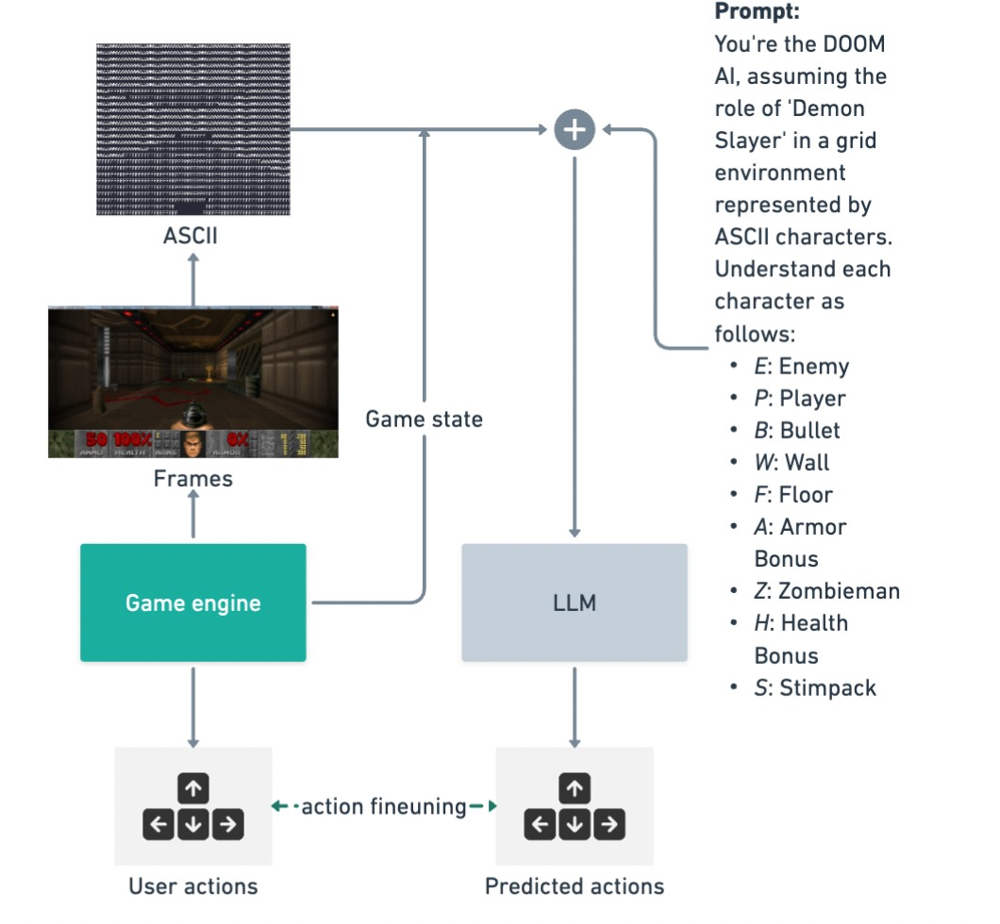

# DOOM Mistral

This repository is home to the DOOM Mistral project, crafted during the CV Mistral Hackathon. Our team developed a deep learning model capable of playing DOOM through visual input alone, utilizing the [ViZDoom](https://vizdoom.farama.org/#) engine, a prominent tool in visual reinforcement learning. We transformed each game frame into a 32x64 grid, representing game elements in each cell, enabling our model to interpret the game visually. For a glimpse into how the model views the game, refer to this video (note: contains strobing effects):

https://twitter.com/i/status/1772075251297550457

We generated training data by playing DOOM, then fine-tuned a LoRA model on `Mistral-7B`, achieving reasonable results. While not an expert, the model can navigate the map and engage enemies when they appear.

Post-training, the model's actions were integrated back into the game, adopting a simplified RL approach due to the hackathon's time constraints.



Watch the model in action here:

https://twitter.com/i/status/1772166935410532709

## Setting Up DOOM Mistral

To initialize, create a virtual environment and install the ViZDoom dependencies:

```bash
pip install -r requirements.txt
```

Rename `.env.example` to `.env` and input your `FIREWORKS_API_KEY`.

To start the game, execute:

```bash
python llm_game.py
```

## Generating Training Data

Capture gameplay for training with:
`python user_game.py`

Access the training dataset at [HuggingFace 🤗](https://huggingface.co/datasets/CV-Mistral-Hackathon/doom-mistral-final), download it, and place it in the root directory.

Upload your dataset to Fireworks.ai for model training:

```bash
firectl create dataset doom-mistral doom_mistral.jsonl
```

## Model Training and Usage

Training settings are listed in `train_settings.yaml`. To train, use:

```bash
firectl create fine-tuning-job --settings-file train_settings.yaml --display-name "DOOM-Mistral"
```

Access the trained model on fireworks.ai, named `doom-mistral`.

To play the game with any LLM, modify `model_id` in line 16, then run:
`python llm_game.py`

### Understanding the Grid

- E: Enemy
- P: Player
- B: Bullet
- W: Wall
- F: Floor
- A: ArmorBonus
- Z: Zombieman
- H: HealthBonus
- S: Stimpack

## Star History Chart

[](https://star-history.com/#umuthopeyildirim/GameCopilot&Date)

## Licensing

ViZDoom's original code is under the MIT license. ZDoom incorporates various sources, each with [distinct licensing](http://zdoom.org/wiki/license).
